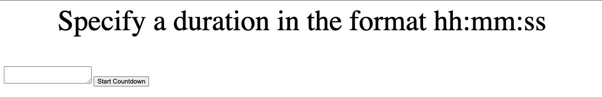

# Simple Timer App - Version 1

Download all the assets in the version 1 folder. Open the index.html file in a browser. You should then be presented with a page that looks as shown below.

In the textbox, specify a duration in the format hh:mm:ss. Note that at present, no input validation is done. Thus, you may encouter weird behavior if you don't specify a duration in the correct format.